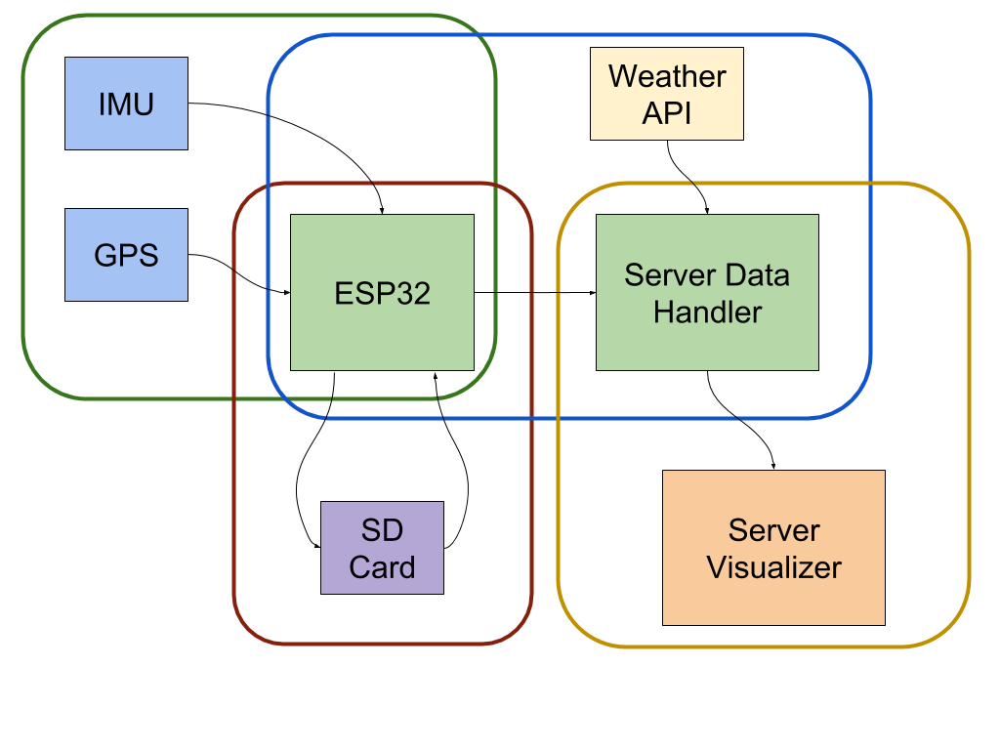

# Dinghy Thingy

## By Maya Nigrin, Jose A. Muguira, Xiaoyang Zhuang, and Raymond Huffman

### **Overview**

The Dinghy Thingy is a small, portable device enclosed in a water-proof box that would be mounted to the inside of a sailing boat. The device would collect data while the boat is on the water, and store said data to an SD card, after which it could be uploaded to our server, where our code would conduct helpful analysis and visualization. We were inspired to do this project because one of our team members is an avid sailor and mentioned how helpful it would be to have a device that can collect data about a boat when it’s on the water. While these types of programs do currently exist, they are typically specialized and do only one task, and are also ludicrously expensive, so we decided to make a version of our own. Our implementation will use an IMU to gather information about the heel of the boat and a GPS to track the path of the boat on the water. This data would then be stored to an SD card and uploaded to our server once the internet is available, where this data would be presented in a friendly, readable way using plots and potentially animations. The device will be battery powered and optimized in such a way that it could last several hours so that the sailor does not have to worry about it dying while they’re on the water. If we have additional time after these components have been implemented, we intend to add a timing system that could be used in races and scrimmages, as well as weather data, so that the sailor can have access to even more comprehensive documentation about their time on the water.

Example of SAP Sailing Analytics in action:  [http://bit.ly/2UZTJc0](http://bit.ly/2UZTJc0)

### **Detailed Description of the Intended Functionality**

The system can be roughly divided into the following four functions: Data collection, data storage to flash memory, uploading data to the server, and visualizing the data online.

1. **Data collection **

    The ESP will log its current GPS coordinates, and some combination of gyroscope and accelerometer data from the IMU to determine boat heel (how tilted the boat is). Data logging should be optimized to capture as many data points as possible while maintaining a battery life of ~3 hours. This could require the use of the ESPs sleep functionality. Other battery saving measures could include an external button to toggle data collection, so that battery is only used to collect the desired data.

2. **Flash memory interface**

    Since the ESP only has 4MB flash memory, and since internet access will be unavailable on a boat, the system must periodically write it's data to external flash memory. At the end of a session of sailing, this data will then be uploaded to a server for processing. This requires interfacing with an SD card, which would be a new peripheral not covered in 6.08. Data will either be written to the SD card continuously, or at regular intervals for optimal power efficiency.

3. **Server interface**

    When the user pushes an external button when they return to the dock at the end of their sailing session, the ESP will attempt to connect to an open wifi network. (The MIT Sailing Pavilion has "MIT", so we will just use that) Once a connection is established, the contents of the SD card will be dumped onto the server, and saved in a format that is easily parsed for visualization. This could be a database, or a CSV file. A CSV is useful if we choose to scan through the data once, sequentially, for visualization. If we choose to extend our functionality with animations that can be scrubbed through using a timeline, a database would allow us to more quickly jump to specific times. With sufficient memory on the server, we could instead load all relevant data into some Python data structure that enables more efficient access. Once the data we've collected is on the server, we will also use some weather API to get the actual wind data from the station nearest to the average of the recorded GPS coordinates over the full time of recording. For our testing implementation, this will be data from the MIT Sailing Pavilion or the weather station on the Harvard bridge.

4. **Data visualization **

    After a good day of sailing, the user will be able to access a webpage hosted by the server that presents analytics from their sail in some interactive format. Our goals for this are inspired by SAP's Sailing Analytics platform, an extremely expensive product used in broadcasts for the Olympics and other professional sailing competitions.

The tracks of all boats sailing at the time should be displayed on screen, overlaid on a map of the area. Note that satellite images are unnecessary. Once static images of the boats' tracks are functional, we will extend this to allow an animated playback of the boats' path through the water, which can also include wind direction as reported from the nearest weather station.

Visualization can be extended further by using the Google Maps API to produce an interactive zoomable/scrollable map that continues to display animated boat tracks.

Reach goals for visualization (for when everything else is working)

When analyzing the replay of a regatta with many boats, it can be difficult to determine which boats are ahead when they split to opposite sides of the course. This can be roughly determined with a line drawn perpendicular to the current wind direction. This line could be added to the visualization, drawn so it intersects the front of the lead boat.

Wind conditions can vary greatly across a race course, especially on the Charles river, where wind is forced in between tall buildings, creating turbulence and irregular flow across the river. This means that wind data from a single station does not accurately represent the true conditions on the water. However, a strong fleet of boats sailing upwind will usually be sailing at their optimal angle relative to the actual wind conditions. This is called sailing "close hauled," where boats are pointed ~45 degrees from the direction of wind. Given a fleet of boats all sailing close hauled, averaging their directions of travel can help to reveal when the wind shifts, and these wind shifts can be incorporated into the visualization. (for context, on the Charles, the wind shifts about once every minute, and sailing fast on the Charles requires you to anticipate and capitalize on these shifts.

### **System Block Diagram**

### **ESP State Machine**

### **Technical Challenges That We Foresee**

1. Getting accurate gps data: As a gps’s performance can be easily affected by outside factors, it might be hard to have accurate data.
2. Combining data from IMU to calculate boat heel: Gyroscope and accelerometer are very sensitive, and the data might have a lot of noises. So we have to do a decent amount of tests to come up with a good method for calculation.
3. Using SD card interface: We haven’t deal with interface between SD card and esp32 before. Thus, it might take some time for us to set this up.
4. Processing data on server: We will have a lot of data to process, so new techniques of processing data might be needed.
5. Visualizing data: This is more frontend-oriented coding instead of the type of coding we’ve been doing in class.
6. Understanding weather API: Understanding how other people’s format of storing data might take some time.

### **Parts List**

1. Waterproof box for the device: [https://www.amazon.com/LOCK-Airtight-Rectangular-Container-10-99-cup/dp/B0000AN4CS/ref=sr_1_20?crid=121C2GOXUVEXP&keywords=food+container&qid=1555231380&refinements=p_n_feature_seventeen_browse-bin%3A16533392011%2Cp_36%3A-1500&rnid=386465011&s=kitchen&sprefix=food+con%2Caps%2C131&sr=1-20](https://www.amazon.com/LOCK-Airtight-Rectangular-Container-10-99-cup/dp/B0000AN4CS/ref=sr_1_20?crid=121C2GOXUVEXP&keywords=food+container&qid=1555231380&refinements=p_n_feature_seventeen_browse-bin%3A16533392011%2Cp_36%3A-1500&rnid=386465011&s=kitchen&sprefix=food+con%2Caps%2C131&sr=1-20) ($9)
2. Micro SD card module: [https://www.adafruit.com/product/254?gclid=Cj0KCQjwtMvlBRDmARIsAEoQ8zRMPSJdlHuGfjhwVC4pspxRikf_RG_AJuzKLwO7MaTa5d1Gs76pldwaAtujEALw_wcB](https://www.adafruit.com/product/254?gclid=Cj0KCQjwtMvlBRDmARIsAEoQ8zRMPSJdlHuGfjhwVC4pspxRikf_RG_AJuzKLwO7MaTa5d1Gs76pldwaAtujEALw_wcB)
3. Micro SD card: [https://www.amazon.com/SanDisk-Ultra-microSDXC-Memory-Adapter/dp/B073JWXGNT/ref=sr_1_3?hvadid=177219289831&hvdev=c&hvlocphy=9002029&hvnetw=g&hvpos=1t1&hvqmt=e&hvrand=2054804712481173564&hvtargid=kwd-4840975295&keywords=micro+sdhc+card&qid=1555230940&s=gateway&sr=8-3](https://www.amazon.com/SanDisk-Ultra-microSDXC-Memory-Adapter/dp/B073JWXGNT/ref=sr_1_3?hvadid=177219289831&hvdev=c&hvlocphy=9002029&hvnetw=g&hvpos=1t1&hvqmt=e&hvrand=2054804712481173564&hvtargid=kwd-4840975295&keywords=micro+sdhc+card&qid=1555230940&s=gateway&sr=8-3) ($7.39)
4. (Possibly) Better gps: [https://www.adafruit.com/product/3133?gclid=Cj0KCQjwtMvlBRDmARIsAEoQ8zT7zY_Zk7f-g_Z5iPWdlt1mRMmc9EQRhDgXOp2yNM_1fdxfCl1AKjQaAqbUEALw_wcB](https://www.adafruit.com/product/3133?gclid=Cj0KCQjwtMvlBRDmARIsAEoQ8zT7zY_Zk7f-g_Z5iPWdlt1mRMmc9EQRhDgXOp2yNM_1fdxfCl1AKjQaAqbUEALw_wcB) ($40)

### **Milestone and Demo Table**

<table>
  <tr>
   <td><strong>DATE</strong>
   </td>
   <td><strong>Person</strong>
   </td>
   <td><strong>Milestone</strong>
   </td>
   <td><strong>Demo</strong>
   </td>
  </tr>
  <tr>
   <td>April 20
   </td>
   <td>Raymond,

Maya, Jose
   </td>
   <td>Determine the key information that we want to save on the SD card for further analysis
   </td>
   <td>Bring a list of data needed with a justification of why is needed
   </td>
  </tr>
  <tr>
   <td>April 25
   </td>
   <td>Xiaoyang
   </td>
   <td>First prototype of ESP sensor code. Code should be able to output GPS coordinates and accelerometer data from IMU.
   </td>
   <td>Output the following to the serial monitor:

-GPS coordinates

-Accelerometer reading
   </td>
  </tr>
  <tr>
   <td>April 25
   </td>
   <td>Raymond
   </td>
   <td>First prototype of SD card communication. Mount the SD card and write dummy files.
   </td>
   <td>Create a file on the SD card

Fill it with readings from some sensor

Print back/display those readings.
   </td>
  </tr>
  <tr>
   <td>April 25
   </td>
   <td>Jose, Maya
   </td>
   <td>Pick a format for saving GPS, Accelerometer data on the server. Try a CSV and a database and make a simple implementation.
   </td>
   <td>Python server scripts for CSV/sql database. Have ESP post a record of GPS, accelerometer data. Use Postman to get the stored data.
   </td>
  </tr>
  <tr>
   <td>May 2
   </td>
   <td>Xiaoyang
   </td>
   <td>Fix issues with sensor reading code, integrate with Raymond's SD card saving prototype.
   </td>
   <td>Show ESP creating a new data file, and writing GPS, IMU data to the file at some interval.
   </td>
  </tr>
  <tr>
   <td>May 2
   </td>
   <td>Raymond, Jose
   </td>
   <td>Prototype of posting SD card data. Pressing a button connects the ESP to WIFI and sends multiple post requests to upload all records on the SD card. After a successful post, local file should be cleared.
   </td>
   <td>Load SD card with dummy data from computer. Plug into ESP and press button to upload to server. SD card file should now be empty.
   </td>
  </tr>
  <tr>
   <td>May 2
   </td>
   <td>Maya
   </td>
   <td>Prototype of data visualization. Using GPS dummy data already on the server, display that data on a webpage in some meaningful format.
   </td>
   <td>Upload dummy data to server. Access the webpage through a web browser. Should display some visual plot of the GPS data.

Extra: overlay plot on an image of a map.
   </td>
  </tr>
  <tr>
   <td>May 9
   </td>
   <td>Xiaoyang, Raymond
   </td>
   <td>Implement FSM for data recording that optimises power efficiency. Sensors should be off in ROOT state. Pressing a button starts recording. Pressing the button again ends recording.

Implement FSM for SD card data saving, reading, and uploading.
   </td>
   <td>Demonstrate that pressing button creates a file on the SD card, and writes GPS and IMU data to the file.

Pressing the other button pauses recording and uploads current data to server, and clears local data.
   </td>
  </tr>
  <tr>
   <td>May 9
   </td>
   <td>Maya
   </td>
   <td>Complete the full visualization of our data as well as an easy-to-use interface to navigate through it. Possibly with some maps API.

GPS tracks should be colored based on speed or by tilt from accelerometer data.
   </td>
   <td>Visit server webpage on web browser, which loads data from the server and displays GPS tracks over time on a map.
   </td>
  </tr>
  <tr>
   <td>May 9
   </td>
   <td>Jose
   </td>
   <td>Finish the code required to parse and manage the data before visualization as well as how data would be erased from server to free space if needed
   </td>
   <td>Show the code working by integrating it with the visualization from Maya and seeing the visualization work correctly with the data that it is being passed to it
   </td>
  </tr>
  <tr>
   <td>May 16
   </td>
   <td>Xiaoyang,

Raymond,

Maya, Jose
   </td>
   <td>All the parts of the project need to be working together without presenting any bugs or errors and meeting all the specifications given at the beginning of the project. Go sailing!

If the system is in a functional state, Raymond will test during sailing practice.
   </td>
   <td>Final Demo for the project:

Alternative 1: Taking our professor in a boat trip to show the device working and the visualizing the data

Alternative 2: Record a video of us going on a boat trip with the device and the showcasing both the video and the visualization for the data from the trip.
   </td>
  </tr>
</table>

<!-- Docs to Markdown version 1.0β17 -->
